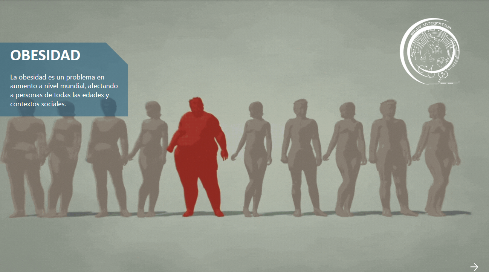
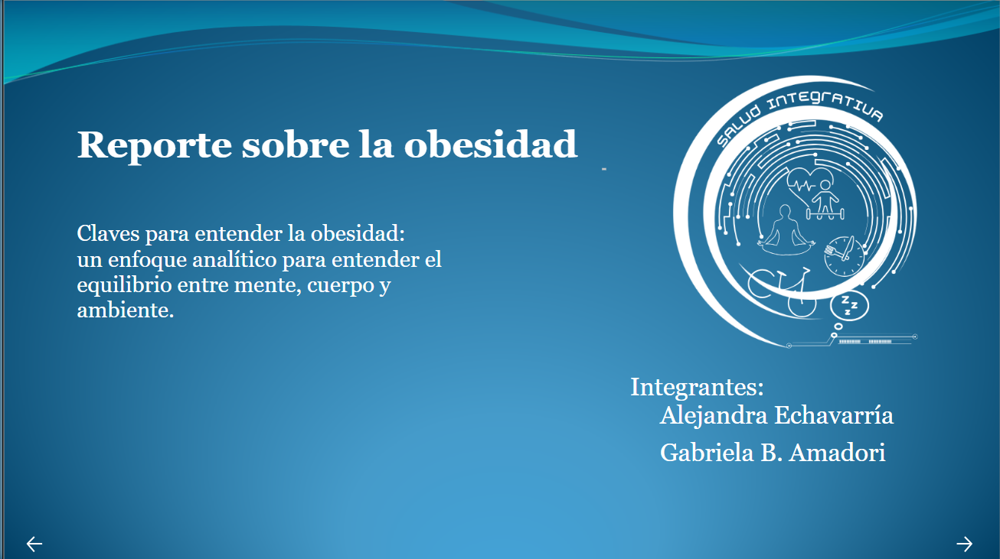
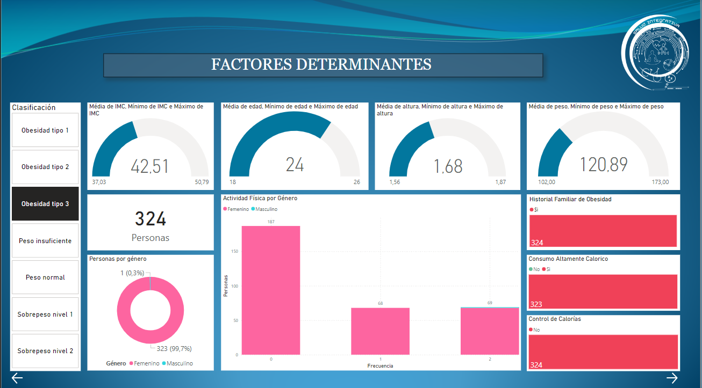
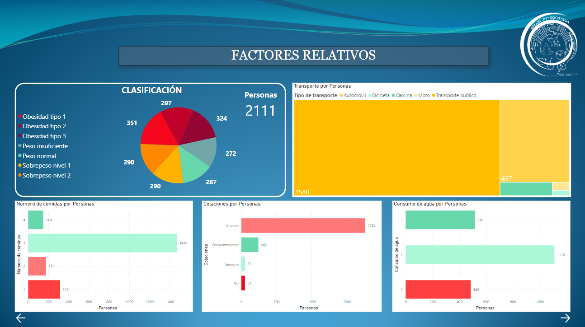
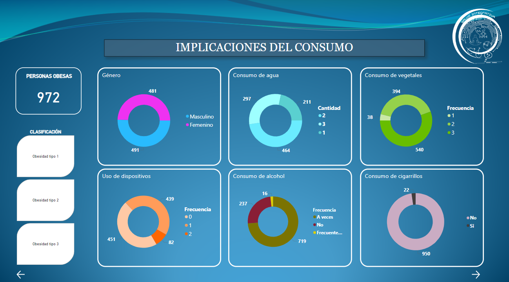
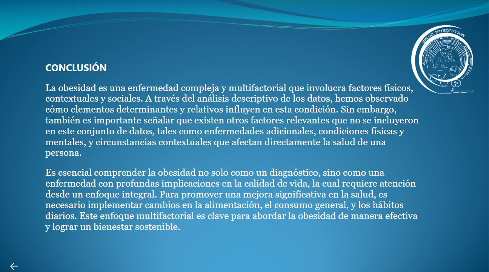

# Relatorio en Power Bi

## Presentación:

A nivel mundial la obesidad se ha duplicado desde 1990. En 2022 más de 2500 millones de adultos estaban con sobrepeso y 890 millones con obesidad. La obesidad se define como una acumulación excesiva y anormal de grasa, nefasta para la salud. Se mide según el índice de masa corporal que se calcula dividiendo el peso por la altura al cuadrado. Una persona con un índice Superior a 25 es considerada con sobrepeso y con más de 30, obesa. La obesidad llega cuando se consumen más calorías que las gastadas. Es un desequilibrio que se atribuye al cambio de costumbres alimenticias y a la baja actividad física en los últimos años. La obesidad puede generar graves problemas de salud como enfermedades cardiovasculares, diabetes, cáncer entre otros. Cada año 2,8 millones de personas mueren como resultado del sobrepeso o la obesidad. Es una de las principales causas de muerte en el mundo

## Portada:

Presentacion del tema y de las integrantes del equipo.

## Factores determinantes:

Presentamos los factores que tienen una relación directa con la obesidad según nuestros datos, explicando cómo estos elementos afectan la clasificación de obesidad y ayudando a la audiencia a comprender su relevancia desde una perspectiva personal.

## Factores relativos:

Describimos factores adicionales que, aunque no tienen una relación directa con la obesidad, aportan información importante sobre la salud y el comportamiento de la población.

## Implicaciones de consumo:

Exploramos el impacto de los patrones de consumo y su relación con los diferentes tipos de obesidad identificados, brindando una perspectiva integral del problema.

## Conclusión:

Finalizamos con una invitación reflexiva, motivando a los participantes a revisar su salud y sus hábitos de vida para mejorar su bienestar y calidad de vida.

